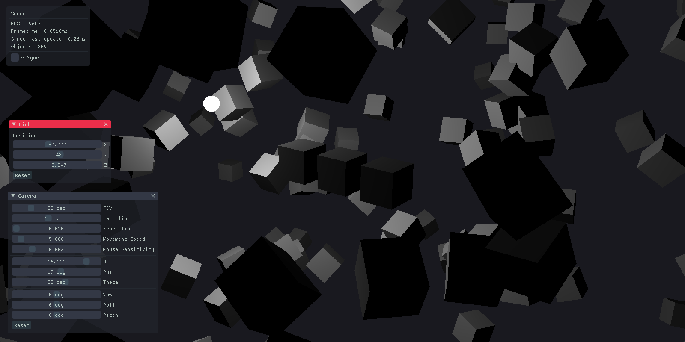

<h1>
    Cinq
    <h2>
        Cinq is my very experimental Direct3D 11 renderer 
    </h2>
</h1> 

### TODOS
- [More/Better error handling](src/Ayanami.cpp#L6)
- [Generalize](src/Geometry/Plane.hpp#L77)

### Latest rendering capability (?)

### Notes
Actions here don't serve any purpose but I'm very intrigued by them so why not (ﾉ´ з `)ノ

## Dependencies
- [nothings - stb](https://github.com/nothings/stb)
- [ocornut - imgui](https://github.com/ocornut/imgui)
